# C语言项目——工程化编程的案例分析

## 一、VSCode安装及环境配置

初始在 Win 下安装 Mingw-w64/GCC 和 GDB，在 VSCode 下打开项目案例，发现在 linktable中需要包含 pthread 头文件。此文件是基于 Linux 系统环境下的头文件，对应 win 系统环境下的 window.h 头文件。所以，本人为了方便后续操作方便，改在 Ubuntu 下进行项目案例分析。

进入Ubuntu，在 Ubuntu 软件中搜索安装 VSCode；VSCode 中下载安装 C/C++ 环境插件；打开对应项目案例文件夹。首先查看 Makefile 文件,  这里 make all 指令表示执行后会编译文件夹下的.c文件：

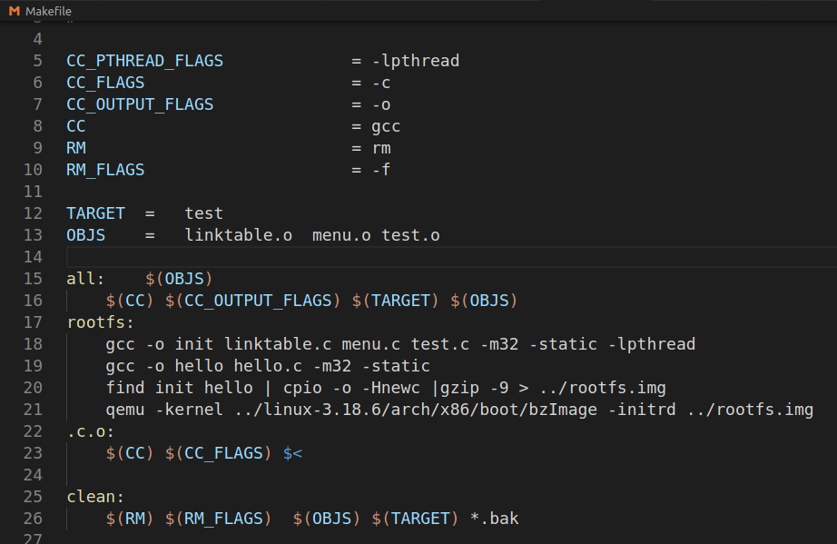

在VSCode终端下运行 make all，编译生成了对应的三个 .c 文件的 .o 文件，因为 Makefile 里没有添加对其他三个 test_.c 的操作，所以当前是不能指令执行这三个c文件。

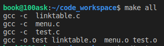

 

在终端下运行 make clean，删除了生成的原本的三个.o文件

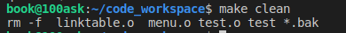

　　

终端下运行 ./test

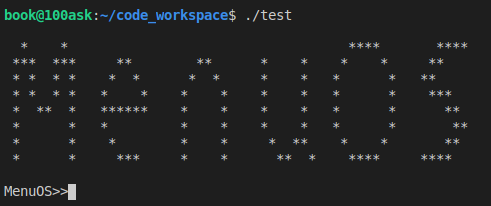

　　

输入已实现的cmd命令名，这里补充了fork、exec和quit指令操作

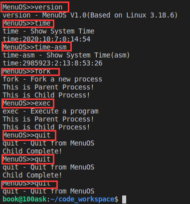

 

## **二、分析代码的艺术**

 

**1.程序块头部注释**

这里标明了代码语言以及该文件的作用，模块的对外接口，方便自动生成开发者文档。

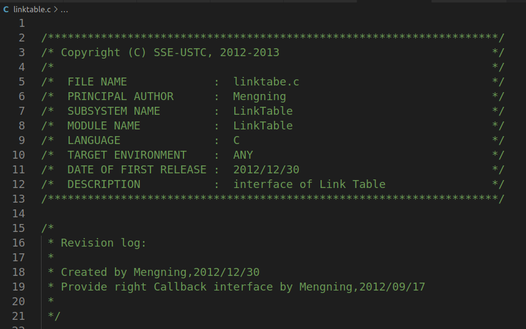

**2.模块化软件设计**

模块化是在软件系统设计时保持系统内各部分相对独立，以便每一个部分可以被独立地进行设计和开发。这个做法被的基本原理是关注点的分离。在此编程项目中也体现到了关注点的分离，首先来看耦合：总体代码文件分成linktable、menu、test三大类，分别实现的是程序接口结构设计、命令菜单解析命令操作以及测试文件。前两类有细分成了.c文件和.h文件，.h文件存放功能实现函数的声明、.c文件存放功能实现函数的定义。这样两两文件又有着联系，命令菜单解析命令操作需要接口结构来体现，测试文件需要基于他们来实现具体案例。然后来看内聚，分为三大类，分别实现不同的功能就是内聚的体现。KISS原则即一行代码制作一件事、一块代码只做一件事、一个函数只做一件事、一个模块只做一件事。

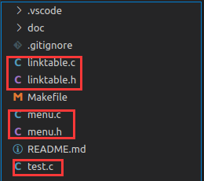

 

**3.** **可重用软件设计**

首先考虑Consumer Reuse和Produce Reuse（消费者重用和生产者重用），Consumer Reuse重在重用已有的一些软件模块代码，以加快项目工作进度。比如说最常见的max()、min()的实现，每次在需要输出最大最小数值时，都要重写一遍。如果把这些思想用一个模块封装在一起，这样每次使用，只需短短一行即可。在本menu案例中，如下函数都是消费者重用的体现

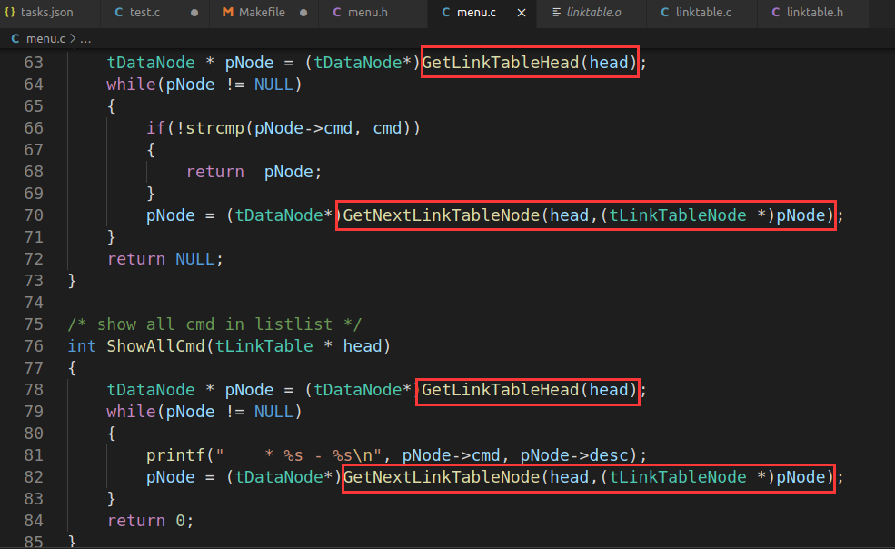

　　Produce Reuse重在设计可重用软件的设计，大致需要注意几个因素：通用模块、通用接口并有清晰完善的定义描述、清晰一致的命名规则等。本案例中在.h文件中即是生产者重用的体现：

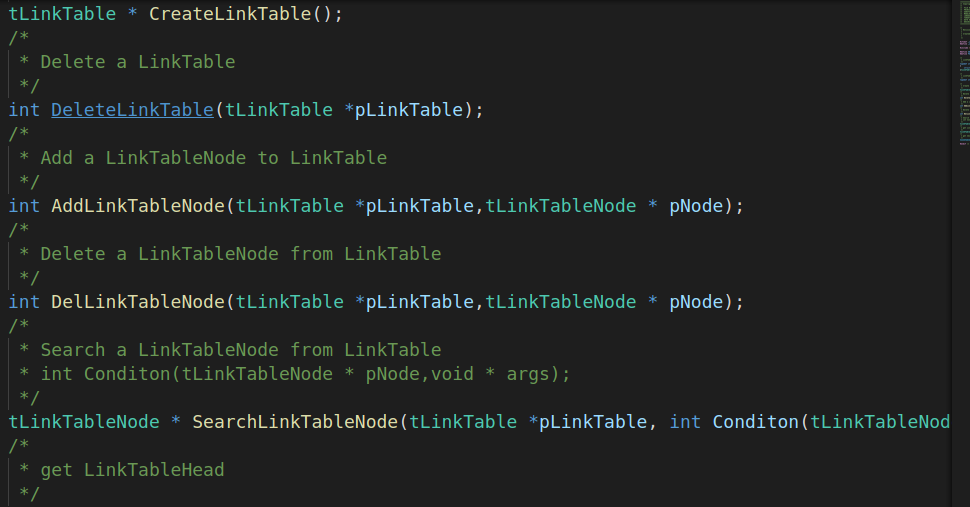

　　每个函数都有一个直观的函数名，以及参数名，在声明结束后会通过注释的方式给出对用到的数据结构和算法的清晰的文档描述。其次是软件模块接口的实现艺术，首先理解函数的接口规格，主要体现callin和callback两个函数方式的接口，如上图的CreateLInkTable、AddLinkTableNode以及DelLinkTableNode三个函数，均给出了callin接口的需要的参数类型和参数名，并且从函数名和参数名就可以很直观的看出其实际的意义。图中最后一个函数拥有一个特殊的参数成员：

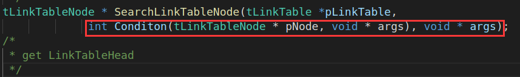

　　这是一个函数，SearchLinkTableNode函数在执行过程中，通过把具体任务传递给condition函数来让他查询目标，这里参数名更改为args间接使上层用户隐藏了对底层人员的信息泄露，其中condition函数的定义如下。可以看到，在函数体内，才会使用cmd这个参数，也就起到了封装信息的作用。

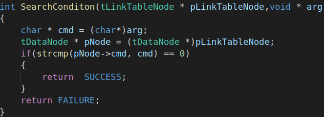

**4.****可重入函数和线程安全**

　　上面有说到消费者重用规则，所以在多个线程使用同一函数时，可以会因为不同的访问顺序导致输出一个错误的答案。比如一个函数初始化一个a值为1，然后对它执行++操作。现在我们假设有这样一种调用顺序，甲线程先执行初始化操作，然后执行++操作。这个时候有一个乙线程剥夺资源然后执行++操作，然后就会得到一个错误的a值。在本案例中有相应的隐患也有对应解决代码。

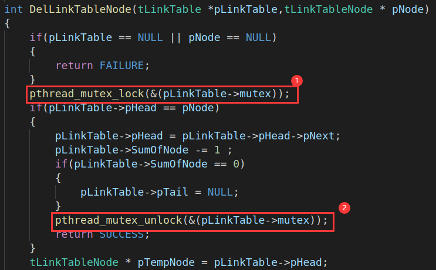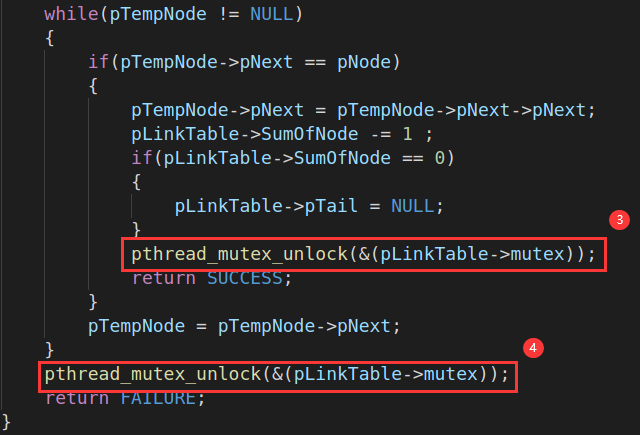

　　引入Linux下的pthread线程头文件。这个DelLinkTableNode函数是实现在一个LinkTable中删除一个结点，首先判断此链表是否存在，存在的话分两种情况分别设置线程锁，然后执行相对应的操作。最后在执行完毕后将线程解锁，其他重入操作就可以执行了。可以看到，在此过程中，只有当某一个线程完全执行结束，下一个才可以执行。线程安全问题都是由全局变量及静态变量引起的。如上的pLinkTable.若每个线程中对全局变量、静态变量只有读操作而无写操作，一般来说，这个全局变量是线程安全的。

 

 

